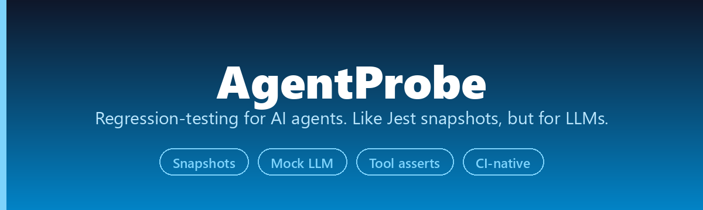
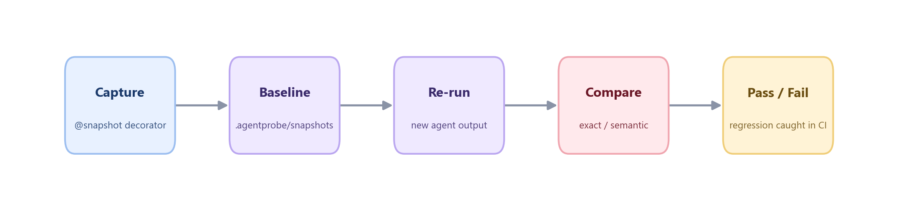

<div align="center">



Capture your agent's outputs, store them as baselines, and catch regressions in CI — with one decorator.

[](LICENSE)
[](https://www.python.org/downloads/)
[](https://github.com/he-yufeng/AgentProbe/actions)

**[English](README.md) · [中文](README_CN.md)** &nbsp;·&nbsp; [Quick Start](#quick-start) · [How It Works](#how-it-works) · [How It Compares](#how-it-compares)

</div>

---

## The Problem

You ship an AI agent. It works great. Two weeks later, you update a prompt, swap a model, or bump a dependency — and something breaks. But you don't notice until a user complains, because **there's no test that catches agent behavior regressions**.

Traditional unit tests don't work for agents. The outputs are non-deterministic natural language, so you can't just `assertEqual` — and writing fixtures by hand costs more than writing the agent.

**AgentProbe** fixes this. One decorator captures your agent's output and saves it as a baseline snapshot. On the next run, it compares the new output against the baseline — exact match or semantic similarity. If something changed, the test fails. Run it in CI, and you catch regressions before they hit production.

## How It Works



## Quick Start

```bash
pip install agentpoke
```

> Heads up: the PyPI distribution is `agentpoke` (the name `agentprobe` was taken), but you import it as `agentprobe` in code — `from agentprobe import ...`.

### 1. Snapshot Testing

```python
from agentprobe import snapshot

@snapshot("summarize_article")
def test_summarize():
    result = my_agent.summarize("The quick brown fox jumps over the lazy dog.")
    return result
```

First run: creates a baseline in `.agentprobe/snapshots/summarize_article.json`. Next runs: compares the output against the baseline and fails if they differ. `async def` tests work the same way. Snapshots are meant to be committed, so CI can compare against them.

Non-deterministic fields and credentials are handled before comparison:

```python
# mask volatile fields at any depth so they don't cause spurious mismatches
@snapshot("summarize_article", redact=["timestamp", "request_id"])

# scrub API keys, tokens, JWTs and emails even inside free text,
# plus your own regex shapes (also globally via --agentprobe-redact-secrets)
@snapshot("summarize_article", redact_secrets=True, redact_patterns=[r"internal-\d{4}"])
```

### 2. Mock LLM

`MockLLM` is a drop-in replacement for `openai.Client` that returns scripted responses, so agent logic tests hit no API:

```python
from agentprobe import MockLLM

mock = MockLLM(responses=[
    "The document discusses three main topics.",
    {"tool_calls": [{"id": "1", "function": {"name": "search", "arguments": '{"q": "test"}'}}]},
])

result = mock.chat.completions.create(messages=[{"role": "user", "content": "Summarize this doc"}])
assert "three main topics" in result.choices[0].message.content
assert mock.call_count == 1  # mock.calls records everything; mock.reset() for reuse
```

Scripted responses are consumed in order; `default_response=` covers the tail once they run out.

### 3. Tool Call Assertions

Verify your agent calls the right tools, in the right shape:

```python
from agentprobe import assert_no_tool_called, assert_tool_called, assert_tool_sequence

assert_tool_called(tool_calls, "web_search", times=1)
assert_tool_called(tool_calls, "web_search", with_args={"query": "latest news"})
assert_tool_sequence(tool_calls, ["web_search", "summarize"])
assert_no_tool_called(tool_calls, "delete_file")
```

The variants cover the messy real cases:

- `assert_tool_sequence(..., contiguous=True)` catches planner reorderings where a tool must immediately follow another.
- `min_times`/`max_times` replace `times` when the exact count is non-deterministic: `assert_tool_called(tool_calls, "api_call", max_times=3)` bounds a flaky retry.
- `assert_max_tool_calls(tool_calls, 10)` budgets the whole run, not just one tool (zero calls still passes).
- `with_args` is a nested subset match and also accepts OpenAI-style JSON string arguments.
- `assert_tool_not_called_with(tool_calls, "run", {"sudo": True})` allows the tool but fails on a dangerous argument subset.

### 4. Schema Validation

```python
from pydantic import BaseModel
from agentprobe import assert_schema

class AgentResponse(BaseModel):
    answer: str
    confidence: float
    sources: list[str]

def test_output_structure():
    output = my_agent.run("What is the capital of France?")
    result = assert_schema(output, AgentResponse)
    assert result.confidence > 0.8
```

### 5. Multi-Step Tracing

Record what an agent did step by step, then assert over the trace or snapshot it:

```python
from agentprobe import Trace, assert_tool_sequence

trace = Trace()
trace.record_llm("planning the search")
trace.record_tool_call("search", {"query": "rainfall 2023"})
trace.record_event("retry", attempt=2)
trace.record_tool_call("fetch", {"url": "https://example.com"})

assert_tool_sequence(trace.tool_calls, ["search", "fetch"])
assert trace.names == ["llm", "search", "retry", "fetch"]
# trace.to_dict() is snapshot-friendly for full-run regression tests
```

### 6. Cost Tracking

Record token usage and assert the run stayed under a USD budget — catching regressions that quietly burn more money. Pricing comes from a dict, a callable, or [TokenTracker](https://github.com/he-yufeng/TokenTracker)'s price table (`pip install toktally`):

```python
from agentprobe import assert_cost_under

assert_cost_under(trace, 0.05, pricing={"gpt-4o": (0.005, 0.015)})  # (input, output) per 1k tokens
```

## Pytest Integration

AgentProbe registers as a pytest plugin automatically:

```python
def test_with_fixture(agentprobe):
    output = my_agent.run("Hello")
    result = agentprobe.capture("greeting_test", output)
    assert result.passed
```

```bash
pytest tests/                                        # run tests
pytest tests/ --agentprobe-update                    # regenerate baselines after intentional changes
pytest tests/ --agentprobe-mode=semantic --agentprobe-threshold=0.85
```

When a snapshot changes, AgentProbe prints a unified diff between the stored JSON and the current output, so CI logs show the exact field or sentence that drifted. The standalone CLI mirrors the flags: `agentprobe run`, `agentprobe run --mode semantic --threshold 0.9`, `agentprobe update`.

### Reviewing failures locally

A failed comparison also saves the actual output to `.agentprobe/last_run/`, so you can review and accept drift without re-running the test suite:

```bash
agentprobe diff              # baseline vs last failing run, with similarity scores
agentprobe diff summarize    # just one snapshot
agentprobe diff --stat       # one line per snapshot: +added -removed counts, for triage before drilling in
agentprobe diff --html report.html  # self-contained HTML report for sharing or CI artifacts
agentprobe review            # walk each failing run: see the diff, then accept, reject, or skip it
agentprobe review --check    # CI gate: list pending failing runs, exit 1 if any
agentprobe accept            # promote all last-run outputs to baselines
agentprobe accept summarize  # promote just one
```

That is the everyday loop: CI goes red, `agentprobe diff` shows exactly which sentence moved, `agentprobe accept` blesses the new normal. No hand-editing JSON, no blind `update` of everything.

## Comparison Modes

| Mode | How it works | When to use |
|------|-------------|-------------|
| `exact` (default) | String equality after serialization | Deterministic agents, structured outputs |
| `fuzzy` | Cosine similarity over character 3-gram sets, pure stdlib, no install | Catching wording drift in CI without an embedding model |
| `semantic` | Cosine similarity via sentence-transformers (`pip install agentpoke[semantic]`) | Non-deterministic LLM outputs, paraphrase-level equivalence |

## How It Compares

| Feature | AgentProbe | DeepEval | Promptfoo |
|---------|-----------|----------|-----------|
| pytest native | Yes (plugin) | Separate runner | CLI only |
| Snapshot baselines | Yes | No | No |
| Semantic comparison | Yes | Yes | Yes |
| Mock LLM | Yes (built-in) | No | Partial |
| Tool call assertions | Yes | No | No |
| Schema validation | Yes (Pydantic) | Partial | No |
| Cloud required | No | Optional | No |
| Config format | Python code | Python code | YAML |

## GitHub Actions

```yaml
- name: Run agent tests
  run: |
    pip install agentpoke
    pytest tests/ -v
```

Commit `.agentprobe/snapshots/` so CI can compare against them.

## FAQ

**Do I need an API key?**
No. `MockLLM` gives you deterministic tests without any API calls. Testing against a real LLM needs that provider's key, which is your agent's dependency, not AgentProbe's.

**What about flaky tests from non-deterministic outputs?**
Use semantic mode with an appropriate threshold, or use `MockLLM` to make the underlying LLM deterministic.

**Does it work with LangChain / CrewAI / AutoGen?**
Yes. AgentProbe tests your agent's output, not its internals. Call your agent inside the test function and return the result.

## Roadmap

**Shipped:** async agent tests, tool-call assertions (presence, count bounds, ordering, forbidden-argument checks), multi-step tracing, cost tracking via TokenTracker, in-terminal visual diffs for snapshot mismatches plus self-contained `--html` diff reports, `pytest-xdist` parallel runs with atomic snapshot writes, pattern-based secret scrubbing for snapshots, and interactive snapshot review (`agentprobe review` walks each changed snapshot and lets you accept or reject it one at a time).

**Planned:**

- **Framework adapters** — first-class step capture for LangChain, LlamaIndex, and the OpenAI Assistants API.
- **Offline semantic mode** — a local embedding backend lighter than sentence-transformers, so paraphrase-level checks need no torch install. (Wording-drift checks already run offline: `fuzzy` mode is pure stdlib.)

## Contributing

Contributions welcome. If you're testing AI agents in production and have ideas for what's missing, open an issue.

## Related Projects

- **[CoreCoder](https://github.com/he-yufeng/CoreCoder)** — understand how a coding agent really works by reading the whole ~1k-line engine end to end.
- **[RepoWiki](https://github.com/he-yufeng/RepoWiki)** — a guided wiki and where-to-start reading path for unfamiliar codebases, a self-hostable DeepWiki alternative.
- **[LiteBench](https://github.com/he-yufeng/LiteBench)** — benchmark any LLM in one command: HumanEval, GSM8K and MMLU built in, plus your own tasks.
- **[agentcikit](https://github.com/he-yufeng/agentcikit)** — the CI safety layer for LLM agents: replay runs, fence tool calls, and triage failures before they ship.

## License

[MIT](LICENSE)

---

<div align="center">

**Stop shipping untested agents.**

[Report a Bug](https://github.com/he-yufeng/AgentProbe/issues) · [Request a Feature](https://github.com/he-yufeng/AgentProbe/issues)

</div>
